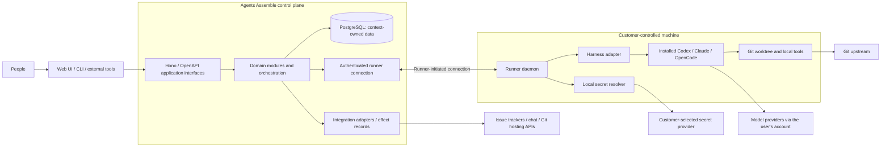

# ADR 0001: portable control plane and customer-controlled runners

Date: 2026-09-12  
Status: **Accepted — installable CLI, customer-local daemon, and existing authenticated harnesses. Detailed protocols and adapter compatibility remain to be validated.**  
Decision ticket: [#2](https://github.com/09millarda/agents-assemble/issues/2)  
Map: [#1](https://github.com/09millarda/agents-assemble/issues/1)

## Decision question

What does Agents Assemble own centrally, what runs on customer-controlled machines, and what can portability, handoff, and environment delivery honestly guarantee?

## Confirmed intent

The user supplies and configures the machines, installs Codex or Claude, and authenticates those harnesses using their normal local accounts. The user then installs the Agents Assemble CLI and starts its daemon, which connects to the selected Agents Assemble deployment over an authenticated outbound tunnel. The daemon invokes the existing local harnesses to progress assigned work. OpenCode and other harnesses remain extension targets behind the same adapter boundary.

The clarification settles the earlier wording about local inference: existing harnesses may call their normal model providers using the user's own authenticated account. Model computation need not remain on-device. Agents Assemble runs no customer agent processes, makes no inference calls, provides no model API keys, and does not proxy model account credentials on its infrastructure. It remains the coordination and shared-context service.

Reuse the installed harness's own authentication mechanism under the intended OS user identity. The daemon must not require users to extract account tokens, upload them, or provide a separate model API key as a substitute for their supported existing login. Agents Assemble enrollment credentials are a separate identity and remain isolated from harness credentials.

This accepts the architectural boundary and portable recovery/environment direction. It does not certify particular harness APIs, subscriptions, SDKs, versions, operating systems, or background-service identity arrangements. The implementation must verify that its chosen invocation path supports the existing local account as required. The detailed protocols below remain design guidance for later validation.

## Decision

The control plane is a portable coordinator. It stores durable definitions, execution progress, artifacts, human decisions, and integration mappings. Customer-controlled runners own local workspaces and drive installed harness processes through versioned adapters. Domain orchestration chooses actions and waits for outcomes; the existing harness owns its agent loop, context compaction, and model interaction.

Model requests travel directly from the local harness to its configured provider under the user's account. The optional browser terminal is a view/control path to that local harness session through the runner connection.

| Responsibility | Owner and contract |
| --- | --- |
| Scheduling and durable progress | Execution context in the control plane; assignments have stable IDs and scoped ownership generations. |
| Product specifications and shared context | Knowledge context; immutable revisions plus editable drafts/history. A runner fetches a scoped snapshot through the API/CLI. |
| Human questions/approvals | Canonical service records; all authorized surfaces refer to the same request and relevant revisions. |
| Processes and worktrees | Customer runner; one isolated worktree per appropriate attempt/work unit, with explicit cleanup and checkpoint lifecycle. |
| Coding-agent behavior | Installed harness; Agents Assemble adapts start/control/events and does not implement its own model/tool loop. |
| Model and harness credentials | Customer machine and its configured credential mechanism; never proxied or centrally stored for inference by the control plane. |
| Application environment secrets | Customer-selected secret authority, resolved by authorized runners at launch or supported refresh boundaries. |
| Third-party integration credentials | The integration adapter's configured credential store; hosted integration workers may need tracker/chat/Git API credentials. These are distinct from model or application credentials. |
| External writes | Prefer service-mediated, recorded intents with current authorization and reconciliation. Any direct runner write credentials need an explicitly weaker recovery/trust contract. |

Keeping agent execution local does not make the hosted service blind to confidential data. It deliberately stores product plans, results, and selected context. Define upload/retention controls; do not capture all terminal output as an incidental persistence strategy. Hosted relay encryption is not automatically end-to-end secrecy from the service operator.

## Connection and harness control

The installable CLI owns service selection/enrollment, local harness discovery/readiness checks, daemon start/stop/restart/status, diagnostics, and de-enrollment. Exact package distribution and command syntax are not chosen here. A user must be able to enroll and start the daemon after installing and authenticating a supported harness without setting up separate model API credentials for Agents Assemble.

Launch the configured existing executable through its supported control interface. Before accepting work, verify the intended daemon identity can access the native harness login. If login is missing or expired, report that the runner needs native reauthentication and resume after repair; do not silently switch provider or authentication mode. A background service or container that runs as a different OS identity needs an explicit, validated local setup.

A runner enrolls with the selected deployment and maintains an authenticated outbound connection, avoiding a requirement to expose a local harness API to the internet. Use the same logical protocol over loopback for a personal installation. The transport may use WebSockets or another tunnel adapter; exact transport, proxy timeouts, and replay protocol need validation.

Commands require IDs, acknowledgments, authorization, deduplication, and replay independently of the socket. Browser reconnect must not start a duplicate process. Terminal streaming is ephemeral; run state and pending approvals remain durable when all browsers disconnect.

Prefer a harness's documented structured control interface. A real terminal/TUI can still be launched or attached when supported. A PTY fallback is a limited adapter mode whose capabilities must be declared; terminal text parsing is not an authoritative execution protocol. No promise of identical “windows,” concurrent controllers, or attachment semantics across harnesses is made before experiments.

Each adapter advertises harness/version, supported account-authentication modes, models and settings, interaction/approval methods, cancellation, resume/import, and attachment capabilities. Record requested and effective settings. An incompatible action fails validation or follows an explicitly selected fallback; it does not silently lower effort, skip an approval, or substitute a model. An API-key-only integration path does not satisfy the required existing-account experience. A separate local-model-only deployment policy is outside this decision's required baseline.

Documentation research supports this adapter approach but is not a production certification. Codex App Server documentation currently marks its transport experimental; exact supported versions and launch interfaces must be pinned and exercised before production commitments. [Harness capability research](../research/harness-capabilities.md).

## Checkpoint recovery and ownership

The portable baseline is **resume the work from a verified checkpoint**, potentially by starting a fresh compatible harness session. Native transcript resumption is an optional per-harness optimization. Process memory, in-flight model/tool operations, unpushed files, and arbitrary harness-local state are not assumed portable.

A checkpoint ties together the playbook/package version, run and attempt, assignment generation, repository identity and confirmed commit, artifact/input revisions, accepted human decisions, environment-profile receipt, requested/effective runtime settings, completed effects, and unresolved outcomes. It contains references and provenance, never secret values.

Proposed handoff protocol:

1. Pause at a supported boundary and reconcile operations whose outcome is unknown. Do not interpret a network timeout as proof the old process stopped.
2. Save required artifacts and checkpoint code to an attempt-specific upstream ref; verify reachability before marking the checkpoint complete. Handle push-success/acknowledgment-loss through reconciliation.
3. Record completion in the owning context and coordinate the assignment transition through explicit commands/events. Do not use a cross-context database transaction.
4. Grant a new assignment generation to an eligible replacement runner. It verifies Git/artifact availability, permissions, environment policy, and required capabilities.
5. Reconstruct the worktree and selected context, resolve fresh authorized credentials, and start the next attempt. Use native session resume only when its compatibility contract is met.

Use optimistic concurrency and leases to reject stale control-plane writes. A lease cannot stop an old machine that retains Git or other direct credentials. Prefer mediated publication, per-attempt refs, and expected-ref checks where available; pause at an uncertain publication boundary if reconciliation cannot establish a safe next action. Cancellation is requested first and confirmed only when its actual scope is known.

Execution owns the authoritative assignment generation and lease and validates them in its own state-change transaction. Runner Fleet provides capability/liveness observations; it does not hold a second authoritative execution lease that would require a cross-context transaction to validate. Acceptance of external-effect intents needs its own scoped authorization and reconciliation protocol; no server-state fence is claimed to undo an already accepted downstream request.

A machine lost before publishing its work loses that unpublished work. A moving branch name is not a checkpoint; retention must keep referenced commits and artifacts available. Git LFS/submodules, toolchain versions, OS compatibility, and local services are additional reconstruction prerequisites when a project uses them. Reproducibility comes from declared and verified inputs, not from `git clone` alone.

## Environment delivery and rotation

Use a versioned **environment profile** with non-secret variables, required logical secret bindings, bootstrap/toolchain requirements, and freshness/restart policy. Deployment-specific bindings map logical names to a configured provider. Shared playbooks declare needed inputs; they do not ship an organization's credentials or private provider paths.

An enrolled runner fetches the authorized profile and resolves values locally through a provider adapter just before launch. Record concrete secret-version references or dynamic-lease metadata where supported. Exact-version replay is conditional on policy and availability; a revoked version must not be resurrected just to reproduce an earlier run.

AWS Secrets Manager and self-hostable OpenBao are researched candidates; neither is a mandatory baseline selected by this decision. Off-AWS machine identity still needs enrollment/root credentials. An internal run grant does not automatically constrain an AWS role or OpenBao policy: each adapter must state the scope the external authority actually enforces. [Environment research](../research/environment-delivery.md).

For rotation, update the secret once at its authority and publish changed bindings/configuration as a profile revision. Connected runners invalidate caches; new attempts resolve the current allowed version. Existing process environments are launch snapshots. Long-running work must refresh through an explicitly supported protocol or checkpoint and restart/recreate; updating `.env` does not rewrite a running process. Related multi-secret changes need an explicit coherent version set or bundle.

Expose pending/applied/failed rotation state. Emergency revocation happens at the credential authority and may require stopping work. De-enrolling a machine or expiring its read token does not erase values already learned by a process. Keep provider bootstrap credentials and the runner's control identity outside child processes using enforceable isolation; a worktree alone does not provide this isolation.

For one machine, a local secret adapter can use an operator-configured OS credential store or private local source. It needs no managed service, but does not provide automatic multi-machine distribution. A shared provider is required for that promise until a separately designed encrypted distribution mechanism exists. A fully unattended restart also requires an explicit unlock/bootstrap mechanism.

## Context transactions and failure semantics

Keep domain contexts as separately owned modules in the initial application. A state change and its outbox message share one context-owned transaction. A consumer's inbox record and local state change share another. The orchestration saga coordinates their outcomes without writing their tables. Event delivery is at least once; ordering is explicit per source aggregate/run stream, not global.

External side effects use durable intent and a stable operation identity, with provider idempotency where available. Unknown outcomes are reconciled or surfaced for recovery before repeating a write. Durable timers, bounded retry policies, and poison/gap handling must survive process restarts. None of these contracts requires choosing a particular queue, workflow framework, or AWS service yet.

## Alternatives and consequences

| Alternative | Assessment for this decision |
| --- | --- |
| Run customer agents in our hosted workers | Conflicts with the user's machine-ownership requirement. |
| Build a new model/tool harness | Conflicts with controlling existing harnesses and expands the product into the wrong responsibility. |
| Treat raw terminal output as all durable state | Does not provide a reliable contract for typed results, approvals, recovery, or adapter compatibility. |
| Require one vendor's hosted tunnel/identity/secrets stack | Conflicts with portable hosting and customer choice. |
| Promise arbitrary live-session migration | Not justified by available interfaces; checkpoint recovery is the honest portable target. |

This direction requires users to operate runners and authenticate their dependencies. The product should make enrollment, health, capability mismatch, expired credentials, and recovery understandable in the UI. “Automated” means explicit routine recovery with visible exceptions, not claiming every failed or unknown side effect can be retried safely.

## Evidence and next decision

Read [harness capabilities](../research/harness-capabilities.md), [environment delivery](../research/environment-delivery.md), and [runtime failure review](../research/runtime-failure-review.md). Official documentation and local CLI inspection informed the proposal; no inference, live integration, failure experiment, or application implementation has been run.

The user clarification resolves #2. The next recommended decision is [the versioned playbook/action contract (#3)](https://github.com/09millarda/agents-assemble/issues/3). Transport protocol, CLI packaging, process isolation, exact secret providers, execution substrate, native-account compatibility under daemon execution, and frontend/editor implementation remain explicit future work. These implementation unknowns do not reopen the settled ownership boundary.
